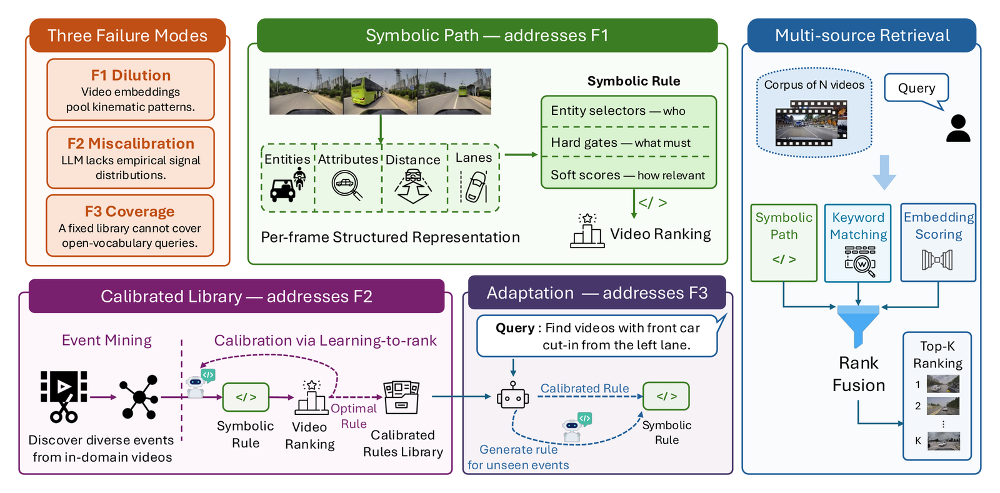

# Driving Video Retrieval for Complex Queries with Structured Grounding

<div align="center">
<div>
    <a href='https://gyeow.github.io/' target='_blank'>Manyi Yao</a>&emsp;
    <a href='https://www.linkedin.com/in/garg-sparsh/' target='_blank'>Sparsh Garg</a>&emsp;
    <a href='https://www.cs.ucr.edu/~cshelton/' target='_blank'>Christian R. Shelton</a>&emsp;
    <a href='https://vcg.engr.ucr.edu/amit' target='_blank'>Amit K. Roy-Chowdhury</a>&emsp;
    <a href='https://abhishekaich27.github.io/' target='_blank'>Abhishek Aich</a>&emsp;
</div>
<div>
    <a href="https://www.ucr.edu/" target="_blank">University of California, Riverside</a> <br>
    <a href='https://www.nec-labs.com/' target='_blank'>NEC Laboratories, America</a> <br>
</div>
<div>
    <h4 align="center">
        <a href="https://neurips.cc/Conferences/2026" target='_blank'>
        
        </a>
        <a href="https://arxiv.org/abs/2606.09109" target='_blank'>
        
        </a>
        <a href="https://gyeow.github.io/strive-d/" target='_blank'>
        
        </a>
    </h4>
</div>
</div>

## Key Features
STRIVE-D is a data-calibrated retrieval framework for finding dynamic events, such as cut-ins and hard braking, in driving videos.
- **Symbolic Path.** Scores videos by matching a per-frame structured representation (entities, attributes, distance, lane) against symbolic rules.
- **Calibrated Library.** Mines diverse events from in-domain videos and calibrates rule thresholds via learning-to-rank.
- **Adaptation.** Handles unseen queries at test time by generating new rules from the calibrated library.
- **Multi-source Retrieval.** Fuses the symbolic path with keyword matching and embedding scoring through rank fusion.


## Model Framework

<div>
    <h4 align="center">
        
    </h4>
</div>

## Results

Retrieval performance (%) of STRIVE-D on three driving benchmarks. Full comparisons are on the [project page](https://gyeow.github.io/strive-d/).

|   Dataset   |   MRR   |   mAP   |   Acc@1   |   Acc@3   |   Acc@5   |   Acc@10   |
|-------------|---------|---------|-----------|-----------|-----------|------------|
|   DrivingDojo   |   38.7   |   8.6   |   26.8   |   48.8   |   53.7   |   73.2   |
|   MM-AU   |   40.5   |   9.5   |   26.5   |   53.1   |   59.2   |   65.3   |
|   CarCrashDataset   |   45.0   |   37.7   |   28.9   |   60.0   |   73.3   |   75.6   |

## Contact
For questions, please contact `myao014@ucr.edu`.


## Citing STRIVE-D
If you find our work helpful for your research, please consider citing the following BibTeX entry.

```BibTeX
@inproceedings{yao2026strive,
   author = {Manyi Yao and Sparsh Garg and Christian R. Shelton and Amit Roy-Chowdhury and Abhishek Aich},
   title = {Driving Video Retrieval for Complex Queries with Structured Grounding},
   booktitle = {Advances in Neural Information Processing Systems},
   booktitleabbr = {NeurIPS},
   year = 2026,
   volume = 39,
   note = {to appear}
}
```
